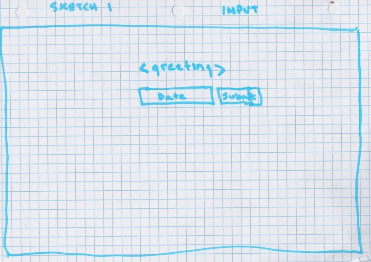
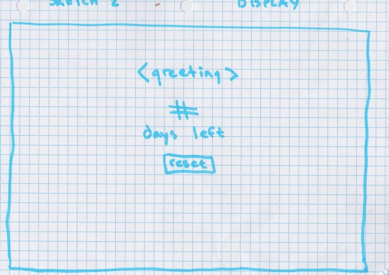
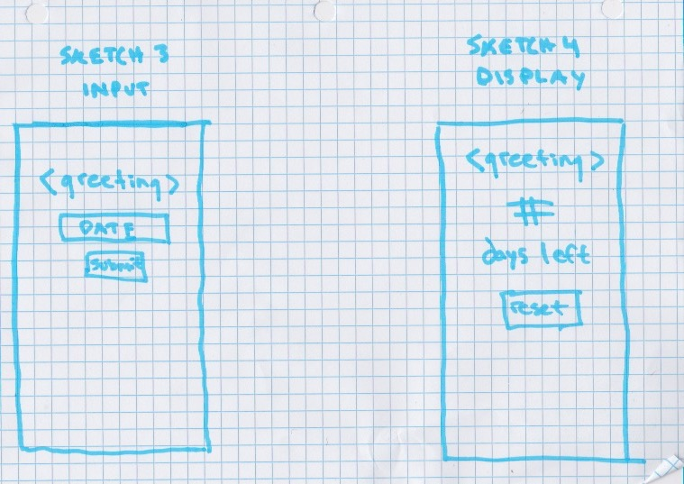
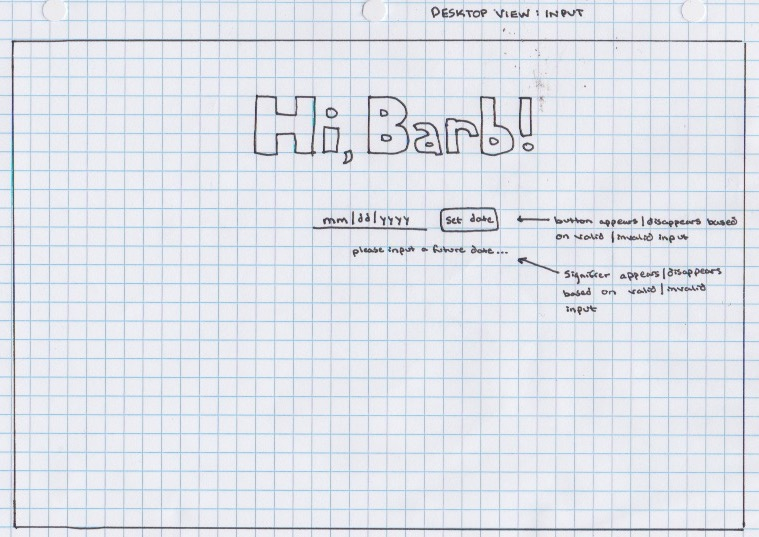
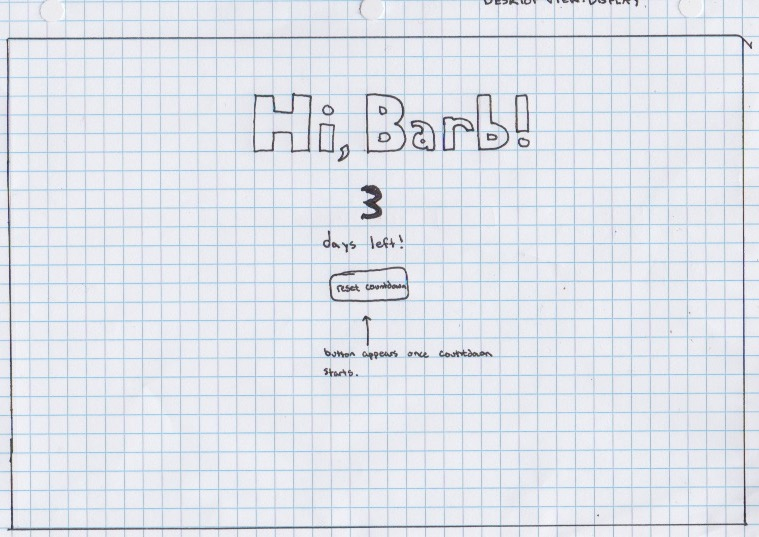
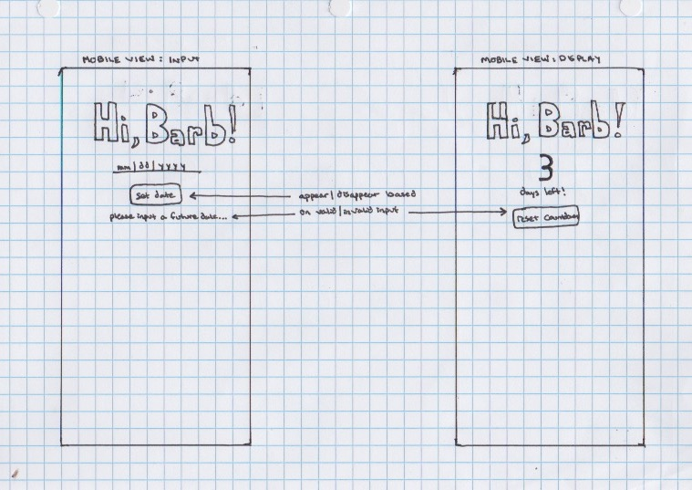

# cym8-project-1

## Project setup
```
npm install
```

### Compiles and hot-reloads for development
```
npm run serve
```

### Compiles and minifies for production
```
npm run build
```

### Lints and fixes files
```
npm run lint
```

# INFO 4340: Project 1 Design Plan

## Client Specifications:
- Counts down to a specific day
- Likes pink, blue, and black as a color scheme
- Looking for a simple, out-of-the-box solution with few options
- Needs to work seamlessly across desktop and mobile (iPhone specifically)

## Client Dislikes about Alternative Options
- Hard to get on your computer/phone (installation process necessary)
- Sign-in is required
- Tracks extraneous/unneccesary information
- Very boring: bad UI/color scheme

## Design Process

1. Thought Process/Rationalizations

    When we conducted the interview with Barb, she was very clear that she heavily disliked the clutter on other countdown applications. She mentioned disliking login/logout options and frivolous required information (like labels).

    For this reason, I kept inputs to a minimum. I only required a date in the future for the application to function. The design specifically generalizes other elements, like the countdown label ('days until'). All other aspects are handled automatically, like switching the input to a countdown display, and vice-versa. 
    
    Furthermore, when conducting the interview, Barb did not seem particularly concerned about the exact time of departure. Rather, she wanted to simply know how many days until her honeymoon began. As Barb said, she just wants to "glance at the page" to get an idea of how many days remain.
    
    Furthermore, Barb is less concerned about missing her trip than she is concerned about the 'emotional' UX dimension of counting down to the big day. Thus, I did not ask for a specific time input. 

    Regarding other on-screen elements:
    <ol>
        <li> A signifier letting her know if she completed the request action correctly ('please input a date in the future...'). </li>
        <li> A button allowing her to clear localStorage and enter a new date. </li>
        <li> A button allowing her to submit the date for local storage and to display the countdown. I specifically chose to use a button for data submission because Barb seems to have used other countdown appliations before and did not have an issue with the input schema/process. Thus, since she is familiar with using a button to set her "countdown date preference" (rather than the information automatically displaying), I decided to include one. </li>
    </ol>

2. Sketches
- Sketch 1: Desktop View - Input

    

- Sketch 2: Desktop View - Display Countdown

    

- Sketch 3: Mobile View

    

3. Wireframes
- Wireframe 1: Desktop View - Input

    

- Wireframe 2: Desktop View - Display Countdown

    

- Wireframe 3: Mobile View

    

